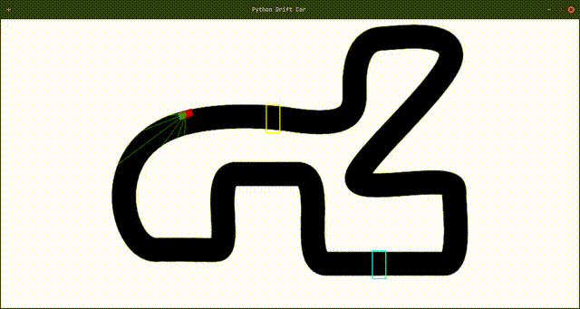

# NEAT-drive 2.0

This project is an updated version of the original NEAT-drive, a project where a car learns to drive on a track using the NEAT (NeuroEvolution of Augmenting Topologies) algorithm. This new version introduces more realistic car physics, simulating physical movements like acceleration, friction, and traction, making the driving behavior more akin to a real-world car.



## How it Works

The project uses a combination of Pygame for the simulation environment and the `neat-python` library for the AI.

### The Car

The car has a simple physics model that includes:
- **Engine Power**: To accelerate forward and backward.
- **Braking**: To slow down.
- **Traction and Friction**: To simulate the grip of the tires on the road, allowing for drifting behavior.
- **Turning**: The turning rate is affected by the car's speed.

The car is equipped with a set of rays that it uses to "see" the track. These rays are cast out from the car, and the distance to the edge of the track is measured. These ray distances, along with the car's current speed, are used as inputs to the neural network.

### NEAT (NeuroEvolution of Augmenting Topologies)

NEAT is a genetic algorithm that evolves neural networks. It starts with a population of simple neural networks and then iteratively evolves them over generations. In each generation, the networks are evaluated based on a fitness function. In this project, the fitness is determined by how far the car travels and how many laps it completes.

The best-performing networks are selected to "reproduce" and create the next generation of networks. This process of evaluation, selection, and reproduction continues, and over time, the networks become increasingly better at driving the car.

## Installation

1.  **Clone the repository:**
    ```bash
    git clone https://github.com/Kavin-95/NEAT-drive2.0.git
    cd NEAT-drive2.0
    ```

2.  **Install the dependencies:**
    ```bash
    pip install pygame neat-python graphviz matplotlib
    ```
    You will also need to install graphviz on your system. For example, on Ubuntu/Debian:
    ```bash
    sudo apt-get install graphviz
    ```

## How to Use

### Training

To train a new model, run the following command:
```bash
python app.py --train
```
The training process will start, and you will see the cars learning to drive. The best-performing network from each generation will be saved, and the final winner will be saved as `winner.pkl`.

### Running the Winner

To run the best-performing car from a previous training session, use the following command:
```bash
python app.py
```
This will load the `winner.pkl` file and run the car on the track.

## License

This project is licensed under the MIT License - see the [LICENSE](LICENSE) file for details.
